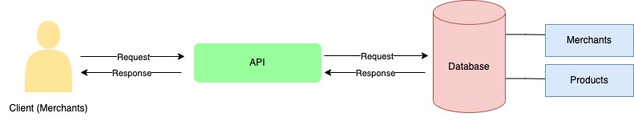
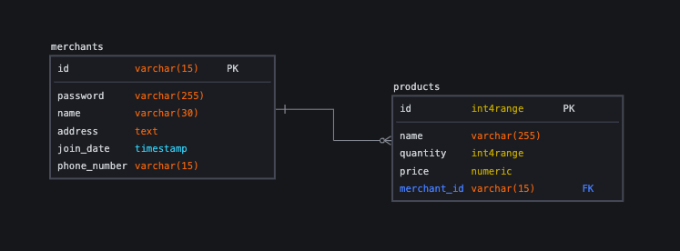

# Merchant Service

This is a merchant service API that can manage user (merchant) accounts and products. The merchant can **create** their own account and **delete** it. And the merchant also possible to manage their own products such as:

1. Add new product
2. Delete the product
3. Update the product details
4. Get list of all their products

## Tech Stack

This project is made by:


## Architecture Diagram



## Database model



## Database

This project doesn't contain database migrations, so you need to create the database and the tables by yourself, here is the syntax:

Create database:

```
CREATE DATABASE merchant_service;
```

Create merchants table:

```
CREATE TABLE merchants (
  	id varchar(15) NOT NULL PRIMARY KEY,
  	password varchar(255) NOT NULL,
  	name varchar(30) NOT NULL,
  	address text,
  	join_date timestamp NOT NULL,
  	phone_number varchar(15)
);
```

Create products table:

```
CREATE TABLE products (
  	id serial NOT NULL PRIMARY KEY,
  	name varchar(255) NOT NULL,
  	quantity integer DEFAULT 0,
  	price decimal(10, 0) DEFAULT 0,
  	merchant_id varchar(15) references merchants(id)
);
```

## How To Run It Locally

Clone the project:

```
git clone https://github.com/fixmannn/merchant-service-project.git
```

Go to the project directory:

```
cd merchant-service-project
```

Install dependencies:

```
npm init
```

Start the server:

```
npm run start
```

## Environment Variables

To run this project, you need to setup the following environment variables to your .env file:

```
LOCALHOST = localhost
PORT = 5432
DATABASE = merchant_service
USERNAME = #your_db_username
PASSWORD = #your_db_password
```

## Postman collection

Here is the postman collection and environment if you need to run the API using postman -> [Environment & Collection](https://drive.google.com/drive/folders/1XMzWqUk7Ke1JGud7UUofOUHg8IiZGnS_?usp=share_link)

## API Endpoint

| Method | Endpoint        | Description                         |
| ------ | --------------- | ----------------------------------- |
| GET    | /merchants      | Get the list of the merchants       |
| POST   | /merchants      | Create new merchant                 |
| DELETE | /merchants/{id} | Delete spesific merchant            |
| GET    | /products       | Get list of the merchant's products |
| POST   | /products       | Add a new product                   |
| PUT    | /products/{id}  | Update spesific product             |
| DELETE | /products/{id}  | Delete spesific product             |

<details>
<summary>API Details: </summary>

## #merchants

### GET /merchants

Get list of the merchants

- URL Params: None
- Headers: Content-Type: application/json
- Data Params: None
- Success Response:
- Code : 200
- Content: `{
message: Get all merchants success,
data: data
}`

### POST /merchants

Create a new merchant

- URL Params : None
- Headers: Content-Type: application/json
- Data Params:

```
{
  id: string,
  password: string,
  name: string,
  address: string,
  phone_number: string
}
```

- Success Response:
- Code: 200
- Content: `message: 'A user has been created'`

- Error Response:
- Code: 400
- Content: `message: {error.message}`

### DELETE /merchants/:id

Delete the specified user

- URL Params: `id:[string]`
- Data Params: None
- Headers:
- Content-Type: application/json
- Authorization: Basic-Auth
- Success Response:
- Code: 200
- Content: `message: Id: {id} successfully deleted`
- Error Reponse:
- Code: 404
- Content: `message: 'Id doesn't Exist' `
- Code: 401
- Content: `message: 'Unauthorized User'`
- Code: 400
- Content: `message: 'Bad request, you don\'t have permission to perform this action'`

## #products

### GET /products

Returns all products that related to merchant

- URL Params: None
- Data Params: None
- Headers:
- Content-Type: application/json
- Authorization: Basic Auth
- Success Response:
- Code: 200
- Content : - Content: `{
message: Get all merchants success,
data: data
}`

### POST /products

Create a new product

- URL Params: None
- Data Params:

```
{
    name: string,
    quantity: number,
    price: number
}
```

- Headers:
- Content-Type: application/json
- Authorization: Basic Auth
- Success Response:
- Code: 201
- Content: `message: 'New product has successfully added'`

### DELETE /products/:id

Delete the specified product

- URL Params: `id=[number]`
- Data Params: None
- Headers:
- Content-Type: application/json
- Authorization: Basic Auth
- Success Response:
- Code: 200
- Content: `message: 'Product has successfully deleted'`
- Error Response:
- Code: 404
- Content: `message: 'Sorry, the product is not found on this merchant'`
- Code: 401
- Content: `message: 'Unauthorized User'`

### PUT /products/:id

Update the specified product

- URL Params: `id=[string]`
- Data Params:

```
{
    name: string,
    quantity: number,
    price: number
}
```

- Headers:
- Content-Type: application/json
- Authorization: Basic Auth
- Success Response:
- Code: 200
- Content: `message: 'Product {product_name} has successfully updated'`
- Error Response:
- Code: 404
- Content: `message: 'Can't update product, the product is not found on this merchant'`
- Code: 401
- Content: `message: 'Unauthorized User'`

</details>
