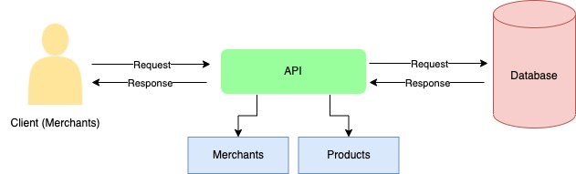

# Mini Project

This is my mini project from **Dibimbing.id**. This is a merchant service API to manage user (merchant) accounts and products.

The merchant can create their own account and delete it. And the merchant also possible to manage their own products such as:

1. Add new product
2. Delete the product
3. Update the product details
4. Get list of all their products

## Architecture Diagram



## Database model


# API Contract

## #merchants

### POST /merchants

Create a new merchant and returns message handler

- URL Params : None
- Headers: Content-Type: application/json
- Data Params:

```
{
  id: string,
  password: string,
  name: string,
  address: string,
  phone_number: string
}
```

- Success Response:
- Code: 200
- Content: `message: 'A user has been created'`

### DELETE /merchants/:id

Delete the specified user

- URL Params: `id:[string]`
- Data Params: None
- Headers:
- Content-Type: application/json
- Authorization: Basic-Auth
- Success Response:
- Code: 200
- Error Reponse:
- Code: 404
- Content: `message: 'Id doesn't Exist' `
- Code: 401
- Content: `message: 'Unauthorized User'`

## #products

### GET /products

Returns all products that related to merchant

- URL Params: None
- Data Params: None
- Headers:
- Content-Type: application/json
- Authorization: Basic Auth
- Success Response:
- Code: 200
- Content : `{products object}`

### POST /products

Create a new product

- URL Params: None
- Data Params:

```
{
    name: string,
    quantity: number,
    price: number
}
```

- Headers:
- Content-Type: application/json
- Authorization: Basic Auth
- Success Response:
- Code: 201
- Content: `message: 'New product has successfully added'`

### DELETE /products/:id

Delete the specified product

- URL Params: `id=[number]`
- Data Params: None
- Headers:
- Content-Type: application/json
- Authorization: Basic Auth
- Success Response:
- Code: 200
- Content: `message: 'Product has successfully deleted'`
- Error Response:
- Code: 404
- Content: `message: 'Sorry, the product is not found on this merchant'`
- Code: 401
- Content: `message: 'Unauthorized User'`

### PUT /products/:id

Update the specified product

- URL Params: `id=[string]`
- Data Params:

```
{
    name: string,
    quantity: number,
    price: number
}
```

- Headers:
- Content-Type: application/json
- Authorization: Basic Auth
- Success Response:
- Code: 200
- Content: `message: 'Product {product_name} has successfully updated'`
- Error Response:
- Code: 404
- Content: `message: 'Can't update product, the product is not found on this merchant'`
- Code: 401
- Content: `message: 'Unauthorized User'`
